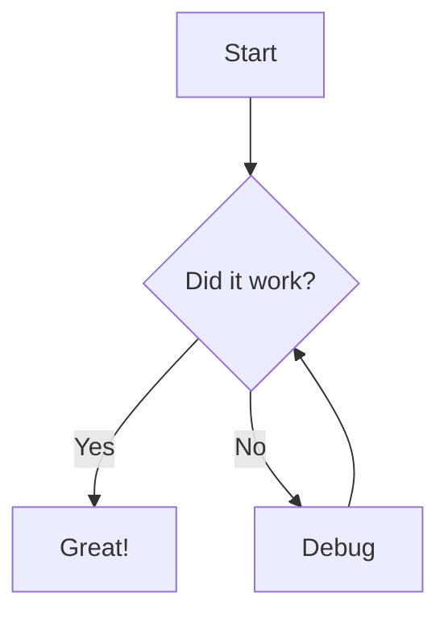
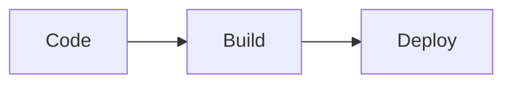
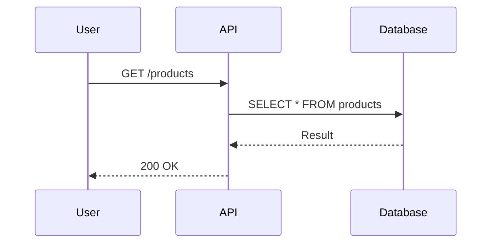
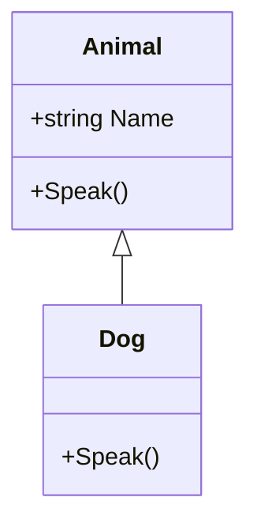

import { Aside } from '@astrojs/starlight/components';

# Using Mermaid

Mermaid is a tool that turns text into diagrams, such as flowcharts, sequence diagrams, and class diagrams.

I use Mermaid to explain flows and structures visually, without needing images.

## How it is configured in the project

<br></br>

The `astro-mermaid` plugin is configured in `astro.config.mjs`, before `starlight`:

```js
import mermaid from 'astro-mermaid';

integrations: [
  mermaid({
    theme: 'neutral',
    autoTheme: true,
  }),
  starlight({ /* ... */ }),
],
```

- `theme: 'neutral'`: base theme of the diagrams.
- `autoTheme: true`: the diagram automatically changes color when we switch between the light and dark themes.

<Aside type="caution" title="Attention!">
  `mermaid()` must come **before** `starlight()` in the `integrations` list, otherwise the diagrams are not rendered.
</Aside>

## Creating a diagram

<br></br>

No import is needed. Just create a code block with the `mermaid` language:

````md

````

Result:


## Flowchart direction

<br></br>

After `graph` we indicate the direction:

| Code | Direction |
|--------|---------|
| `TD` or `TB` | Top to bottom |
| `BT` | Bottom to top |
| `LR` | Left to right |
| `RL` | Right to left |



## Sequence diagram

<br></br>

Useful to show the communication between systems:

````md

````


## Class diagram

<br></br>

Useful for object-oriented programming studies:

````md

````


## Other types of diagrams

<br></br>

Mermaid supports several other types, such as `stateDiagram-v2`, `erDiagram`, `gantt`, `pie`, and `journey`.

<Aside type="tip" title="Tip">
  We can test and build diagrams in the online editor [mermaid.live](https://mermaid.live) and then copy the code to the page.
  The full list of diagrams is in the [official documentation](https://mermaid.js.org/intro/).
</Aside>
