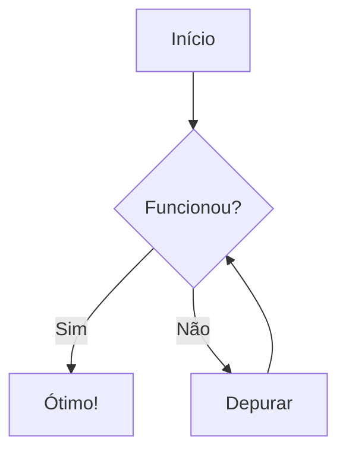
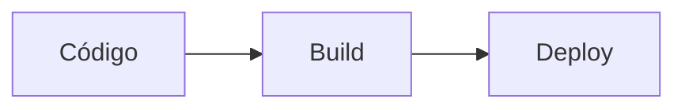
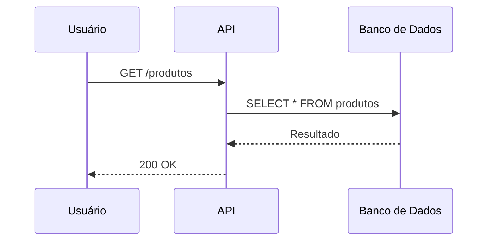
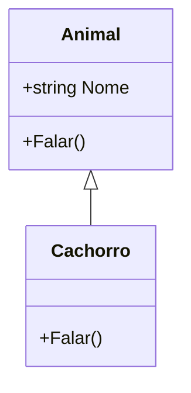

import { Aside } from '@astrojs/starlight/components';

# Utilizando Mermaid

Mermaid é uma ferramenta que transforma texto em diagramas, como fluxogramas, diagramas de sequência e diagramas de classes.

Utilizo Mermaid para explicar fluxos e estruturas de forma visual, sem precisar de imagens.

## Como está configurado no projeto

<br></br>

O plugin `astro-mermaid` está configurado no `astro.config.mjs`, antes do `starlight`:

```js
import mermaid from 'astro-mermaid';

integrations: [
  mermaid({
    theme: 'neutral',
    autoTheme: true,
  }),
  starlight({ /* ... */ }),
],
```

- `theme: 'neutral'`: tema base dos diagramas.
- `autoTheme: true`: o diagrama muda de cor automaticamente quando alternamos entre tema claro e escuro.

<Aside type="caution" title="Atenção!">
  O `mermaid()` precisa ficar **antes** do `starlight()` na lista de `integrations`, senão os diagramas não são renderizados.
</Aside>

## Criando um diagrama

<br></br>

Não precisa de import. Basta criar um bloco de código com a linguagem `mermaid`:

````md

````

Resultado:


## Direção do fluxograma

<br></br>

Após `graph` indicamos a direção:

| Código | Direção |
|--------|---------|
| `TD` ou `TB` | De cima para baixo |
| `BT` | De baixo para cima |
| `LR` | Da esquerda para a direita |
| `RL` | Da direita para a esquerda |



## Diagrama de sequência

<br></br>

Útil para mostrar a comunicação entre sistemas:

````md

````


## Diagrama de classes

<br></br>

Útil para estudos de orientação a objetos:

````md

````


## Outros tipos de diagramas

<br></br>

O Mermaid suporta vários outros tipos, como `stateDiagram-v2`, `erDiagram`, `gantt`, `pie` e `journey`.

<Aside type="tip" title="Dica">
  Podemos testar e montar os diagramas no editor online [mermaid.live](https://mermaid.live) e depois copiar o código para a página.
  A lista completa de diagramas está na [documentação oficial](https://mermaid.js.org/intro/).
</Aside>
